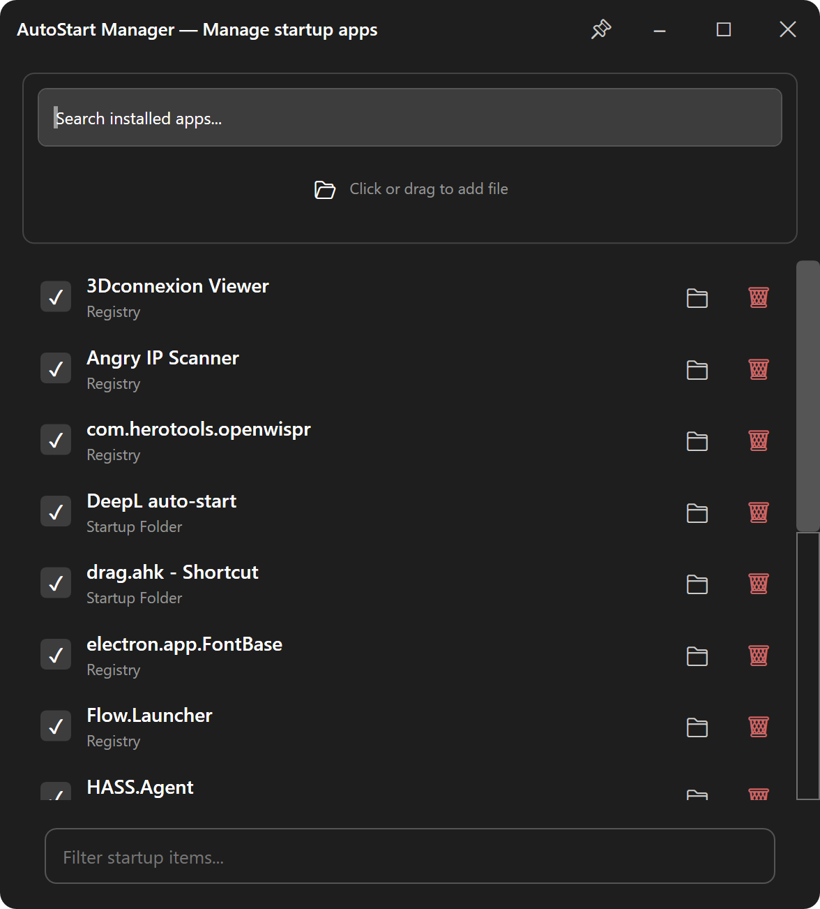

<h1>
  
  &emsp;AutoStart Manager
</h1>

A lightweight Windows tool to manage startup applications — view, add, remove, and toggle startup items.
<br><br>
<p>
  
</p>

## Features

- **View startup items** — list all programs that run at startup from the registry and the Startup folder
- **Toggle on/off** — enable or disable startup items without deleting them
- **Add items** — search installed apps from the Start Menu, drag & drop `.exe`/`.lnk` files, or browse manually
- **Remove items** — permanently delete startup entries

## Usage

1. Launch the app — all current startup items are displayed
2. Use the checkbox to enable/disable an item
3. Click **🗑** to remove an item
4. Click **📁** to open the file location
5. Type in the **Filter startup items** box to search
6. Search installed apps in the **Search installed apps** box and click **+** to add them
7. Drag & drop a `.exe` or `.lnk` file onto the drop zone

## Requirements

- Windows 7 or later
- .NET 8.0 Runtime (only for framework-dependent build)

## Download & Run

Two options:

| Option | Size | Requires Runtime |
|--------|------|------------------|
| **Framework-dependent** (`publish\`) | ~200 KB | .NET 8.0 Runtime |
| **Self-contained** (`publish_selfcontained\`) | ~160 MB | Nothing — includes everything |

### Framework-dependent (smaller)

```bash
dotnet publish -c Release -o publish
```
Run on any machine with .NET 8 Runtime installed.

### Self-contained (portable)

```bash
dotnet publish -c Release --self-contained true -r win-x64 -o publish_selfcontained
```
Run on any Windows x64 machine — no runtime needed.
